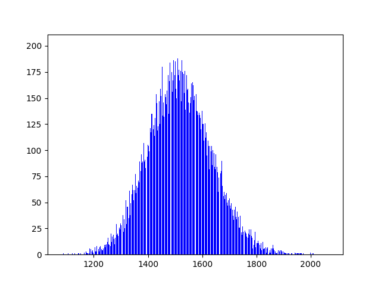

# Baseline

For the baseline, we ran an algorithm that produces a random schedule. We created lectures, practica and tutorials (in a general class called `Activity`) for each course, adjusted to the amount of students that signed up for the course. Sometimes, more than one tutorial/practicum needs to be created because the number of students enrolled is larger than the maximum number of students allowed in a tutorial/pracitcum. After this, we chose a random roomslot for every activity. We did not take into account the maximum amount of students allowed in a room. If we would have done so, the algorithm would become less random. We ran the code 10000 times, calculating the number of malus points at every run. The results can be seen in the histogram below.

## Bias

The way we calculate the number of tutorials/practica needed now is by dividing the number of enrolled students by the maximum amount of students allowed in a tutorial/practicum, and then ceiling that number. For example, if there are 27 students enrolled and the tutorial has a maximum of ten students, we create three tutorials. However, more tutorials/practica than the minimum is also an element of the state space.s

## Plot

In this plot, one can see the amount of pandapoints on the x-axis and the frequency on the y-axis. It appears to be a normal distribution. The mean of the plot is around 1515, for 10000 runs. This means that in making algorithms an algorithm is better than random if the amount of malus points is significantly less than 1515. 
